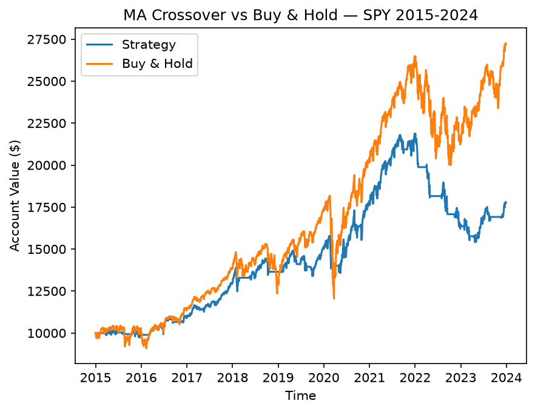

# Moving Average Crossover Backtester

An event-driven backtesting engine in Python that simulates moving average crossover strategies across multiple assets, models transaction costs and position sizing, and tests whether optimized parameters survive out-of-sample.

**Conclusion: the strategy doesn't work.** It underperforms buy-and-hold on every asset tested, and the parameters that win on training data lose money on held-out data. This repo documents how I established that.

## What it does

Downloads price data, computes two moving averages, and simulates buying when the short MA crosses above the long MA and selling when it crosses below. The simulation loop maintains cash and position state day by day, charges a fee on every trade, and reports risk-adjusted metrics alongside raw returns.

The backtest is a function taking the ticker data, both MA windows, and a position size, which makes it possible to sweep parameter combinations, compare assets, and vary exposure without touching the simulation logic.

## Out-of-sample test

This is the main result.

I split the data into a training period (2015-2020) and a test period (2021-2024) that the parameter search never saw. On the training period I swept 144 combinations — short windows 10 to 50, long windows 50 to 200 — and took the best performer. That was 15/70, which turned $10,000 into $18,507 on training data.

Then I ran it on the test period.

| Strategy | Test result | Return | Sharpe | Max DD |
|---|---|---|---|---|
| 15/70 (search winner) | $9,438 | -5.6% | -0.12 | -25.0% |
| 20/50 (convention) | $9,370 | -6.3% | -0.14 | -29.6% |
| Buy & hold | $13,474 | +34.7% | — | — |

The optimized parameters lost money on data they hadn't seen, while simply holding SPY returned 34.7%. Both Sharpe ratios are negative, meaning the strategy lost money while taking risk — cash would have scored zero.

Two failures worth keeping distinct:

**The optimization was worthless.** On training data 15/70 beat 20/50 by $1,424. On test data, by $68 — indistinguishable from zero. Whatever advantage the search found did not exist outside the window it searched.

**The strategy itself doesn't work.** Both parameter sets lost money while the market gained a third. This isn't only a tuning problem.

The test period also contains the 2022 bear market, which is exactly the regime a trend-following strategy is supposed to handle. It didn't. It whipsawed through the chop and missed the 2023 recovery.

## Why the search found noise

The parameter surface is not smooth. Holding the short window at 15 and varying the long window on training data:

| Long window | Result |
|---|---|
| 50 | $17,084 |
| 60 | $18,450 |
| 70 | $18,507 |
| 80 | $15,379 |
| 90 | $15,456 |
| 100 | $13,261 |

A ten-day change drops performance by $3,100. If these parameters captured something real about market behavior, neighboring values would perform similarly. They don't. The peaks are artifacts of which price movements happened to fall on which side of a crossover.

Two other patterns from the sweep: long windows are systematically worse, since slower signals mean more time in cash. And 50/50 returns exactly $10,000 — identical windows mean the MAs are always equal, neither condition fires, and no trades happen. A useful check that the logic behaves.

## Multi-asset results

20/50 crossover, 2015-2024, 0.1% transaction cost, full position.

| Ticker | Strategy | Buy & hold | Capture | Sharpe | Max DD | Trades |
|---|---|---|---|---|---|---|
| SPY | $17,752 | $27,191 | 45% | 0.62 | -29.6% | 43 |
| QQQ | $21,135 | $42,733 | 34% | 0.62 | -27.1% | 45 |
| AAPL | $28,912 | $78,691 | 27% | 0.69 | -29.8% | 51 |
| MSFT | $27,465 | $92,958 | 21% | 0.64 | -44.1% | 47 |
| GLD | $12,180 | $16,758 | 32% | 0.26 | -20.7% | 49 |

Capture is the strategy's gain as a fraction of buy-and-hold's gain.

It loses on all five — a broad index, a tech index, two individual stocks, and a commodity. Different volatility profiles, same outcome.

**The failure scales with how well the asset did.** MSFT gained the most and the strategy captured the least at 21%. SPY gained the least and it captured the most at 45%. That is the mechanism in plain view: every stretch out of the market misses upside, so the more upside there was, the more got left behind.

**Drawdown protection didn't materialize.** On MSFT the strategy's drawdown was worse than holding, at -44.1%. The signal is slow enough that it can sell after a drop and buy back before the next one.

One observation I can't fully explain: Sharpe clusters tightly at 0.62, 0.62, 0.69, 0.64 across four very different assets. My guess is that the crossover fires at a similar rate regardless of the underlying, so the fraction of time spent in cash — and therefore the risk profile — converges. I haven't tested that.

## Position sizing

SPY, 20/50, varying the fraction of capital deployed per trade.

| Position size | Final value | Sharpe | Max DD |
|---|---|---|---|
| 1.00 | $17,752 | 0.62 | -29.6% |
| 0.75 | $15,570 | 0.62 | -23.0% |
| 0.50 | $13,550 | 0.61 | -16.0% |
| 0.25 | $11,693 | 0.61 | -8.4% |

Sharpe is flat across all four. Scaling the position scales returns and volatility proportionally, so the ratio doesn't move — which means position sizing changes how much risk you take, not the quality of the risk-adjusted return. It can't fix a bad strategy. Quarter-size cuts drawdown by two thirds, but the underlying edge is unchanged; you just lose more slowly.

Drawdown scales close to linearly with size, which is a reasonable correctness check on the implementation.

## Full-period equity curve



Running 20/50 across 2015-2024:

| | Strategy | Buy & Hold |
|---|---|---|
| Final value | $17,752 | $27,191 |
| Return | +77.5% | +172% |
| Sharpe | 0.62 | 0.71 |
| Max drawdown | -29.6% | -33.7% |

Trades: 43. Total fees: $599.45.

The raw return gap looks worse than the risk-adjusted one. Buy-and-hold more than doubles the strategy's return but its Sharpe is only 13% higher, because the strategy sits in cash for long stretches and cash has no volatility — numerator and denominator shrink together.

The drawdown tells the other half. -29.6% against -33.7% is real downside protection, but four percentage points of protection cost ninety-five percentage points of return. The -29.6% also shows the limits of a 50-day signal: the strategy was still in the market for most of the COVID crash, because by the time the long MA crossed down the damage was done.

## Transaction costs

Adding a 0.1% fee per trade dropped the full-period final value by $780, but only $599 of that was fees. The remaining $181 is compounding — money spent on fees early wasn't invested for the years that followed.

The trade count is the more interesting number. 43 trades over nine years is about 4.8 round trips per year, far more churn than I expected. The strategy trails buy-and-hold by $9,438 and only $780 of that gap is trading costs, so the whipsaw itself is roughly twelve times more expensive than the fees.

## A bug I found

In the sell branch I originally derived the post-sale position as `shares - (cash - old_cash)/price` instead of setting it to zero directly. Floating-point rounding left roughly 1e-15 rather than exact zero, which broke the `shares == 0` check in the buy condition. After the first sell the strategy could never buy again, and the reported final value was understated by about $8,400.

I isolated it by reverting one line at a time and rerunning. The fix was assigning zero directly rather than deriving it. The lesson is not to test floating-point values for exact equality — either assign known values directly or compare within a tolerance.

## Limitations

Trades at the close using signals computed from that same close, which assumes instant execution. Transaction costs are a flat percentage, ignoring bid-ask spread and slippage. Sharpe is computed against a zero risk-free rate. No short selling — the strategy is either long or flat.

The train/test split is a single split at one date. Walk-forward validation across multiple windows would be more rigorous, since one holdout period could itself be unrepresentative.

## Requirements

Python 3, yfinance, pandas, numpy, matplotlib

## How to run

```
pip install yfinance pandas numpy matplotlib
python backtest.py
```

The parameter sweep is commented out by default since it takes about 13 seconds.